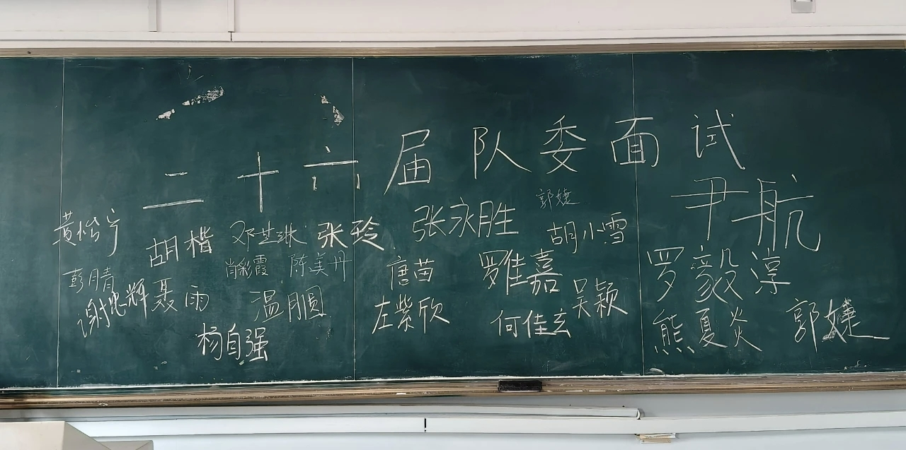
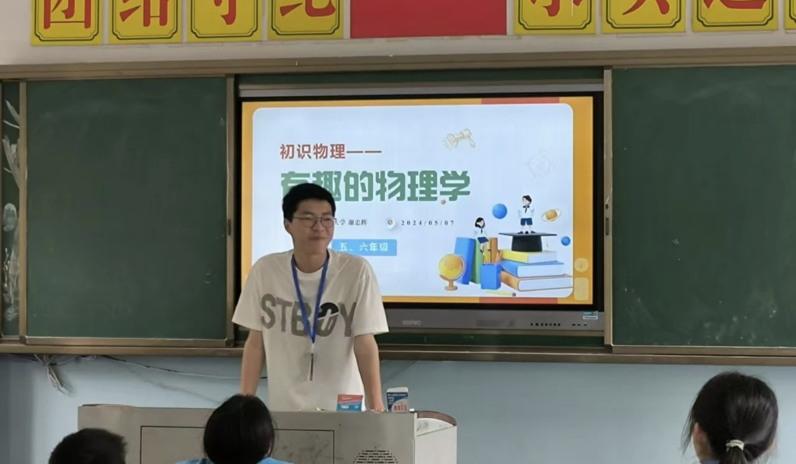
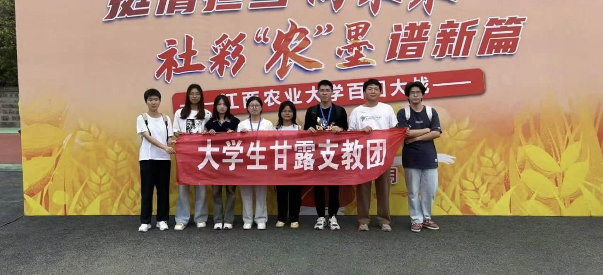
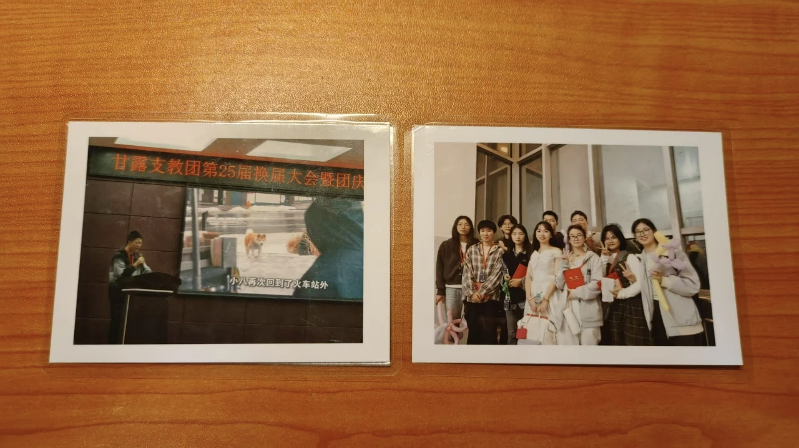

:::tip[01]
:::

2025年5月24日，随着甘露新一届队委选拔结果的新鲜出炉，我在甘露近两年的时光也就此宣告结束。

这是一段少见的、快乐的、难忘的，与一群志同道合的小伙伴们共同为自己心中所想而奋斗的时光。

_▲图为24日，在学校五教进行的甘露26届队委选拔_

:::tip[02]
:::

和甘露的故事，要从2023年的那个秋天开始说起。

刚刚踏入大学校园的我总想抓住些什么，不满足于仅仅局限于学院的部门，我选择了加入甘露支教团，并且成为了上课部的一员。

还记得面试时，部长问我为什么选择上课部，我说，因为我喜欢看孩子们眼睛发亮的样子。

后来才知道，孩子们的眼睛真的会发光——特别是当你站在他们面前，回答他们任何天马行空的想象的时候。

那种感觉，是一辈子都忘不了的。

支教是在每周二的下午，学校周边梅岭脚下，一座很小的村子里，一所很小的乡村学校——前进小学。

我们上课的伙伴一起从学校出发，打车到村子里头。村子实在是太偏了，以至于回学校时，我们要往外走很远才能够打得到车。

尽管车费自付、教具自备、没有奖励，但我们似乎总是乐此不疲，大概这就是热爱吧。

前进小学只有一栋楼，校长、老师，有六个年级的学生们就这样都挤在一栋三层高的楼里。楼下就是操场，只有普通操场一半大，旁边是卫生间，还有一座矮房，便是保安亭了。

这就是前进小学。麻雀虽小，但五脏俱全。

:::tip[03]
:::

第一次上课时的场景至今清晰。

“同学们大家好，我是来自江西农业大学的谢忠辉，你们可以叫我谢老师。”

“大学？哇是大学生！老师好！”

“老！师！你今天讲什么呀！~”

……

我的上课大部分以科普为主，配合念PPT，有点枯燥。但其实他们并不在乎你黑板上写了什么，他们只是对一切新鲜的事物都展现出极大的好奇心。

后来我学乖了，自带一些小道具，现场给他们演示，对PPT的依赖也逐渐淡了。比如，往两张自然垂落的纸中间吹气，两张纸会向中间靠拢；一个装满水的杯子，再加若干个硬币，水却不会溢出来；等等。

_▲图为我在前进小学的一次物理启蒙课_

效果很好，小朋友们很爱听。更让我惊喜的，是几乎每次都有小朋友能够讲出这些现象是因为什么。真的很棒！

去的次数多了，他们便慢慢认得到我们了。起初只是远远地站着，怯生生地喊一声“老师好”，后来渐渐敢凑过来，问问我们下周还来不来。

他们的信任来得简单又直接，有时候我甚至分不清，到底是我们在教他们，还是他们在治愈我们。

放学时，我们走在路上，要出外面打车回学校。偶尔遇到有坐家长的车回家的小朋友，看见我们会很热情的挥手，直到再也看不见。

心里酸酸的，又满满的。

我知道，总有一天，他们会忘记我的名字，忘记我教过的课，就像忘记我们许多个匆匆来又匆匆走的支教小伙伴一样。但这些经历，会永远留在我的记忆里，成为我大学时光里最柔软的部分。

永远。

:::tip[04]
:::

很快，差不多一年就过去。

2024年5月，换届。我当然毫不犹豫地选择留了下来，成为了甘露支教团的25届队委，和另外一位小伙伴一起，担任上课部部长，带领部员们继续去给小朋友们上课；也和其他许多优秀的队委伙伴一起，带领甘露继续向前发展。

然而，天有不测风云。

我们很遗憾地收到通知，由于前进村进行了拆迁安置，前进小学在校学生逐年下降，上级部门将前进小学撤并到了南昌市昌北二小教育集团青岚校区。

这意味着我们以后很难再见到那群小朋友了。

不过，也许是缘分。新学期开始，我们的支教地点改在了双港小学和昌北二小教育集团青岚校区，原帮扶部改设科技部。

这是甘露向前迈出的一大步！

在前往昌北二小青岚校区找校方谈合作的时候，我们在原前进小学校长的带领下，来到了部分原前进小学小朋友们的教室里。

意料之外，又或者是是意料之中，他们还记得我们！

甘露在前进村的故事从未结束，只是翻开了崭新的一章。孩子们会长大，我们会毕业，但那些共同经历的温暖时光，会永远定格在记忆里，成为我们最珍贵的行囊。

:::tip[05]
:::

但新的故事总要开始。

成为队委后，肩上的责任便又重了几分。更多的不是直接去给小朋友们上课，而是带领部员们去继续传递这份温暖。

第一次主持会议时，看着台下新加入的学弟学妹们期待的眼神，我突然意识到，自己不再只是那个周二去支教的“小老师”了。

现在，我要带着更多人，把这份温暖继续传递下去。渐渐地，我发现自己变了。以前总想着怎么把课讲得有趣，现在要更关心如何让整个团队走得更远。看着部员们从生涩到熟练，那种欣慰感，是任何荣誉都无法替代的。

也许这就是成长吧：从被带队去支教的人，变成带队去支教的人。

虽然肩上的担子越来越重，但心里却越来越踏实。因为我知道，我们正在做的，是一件值得再用一年去坚守的事。

在管理的过程中，也遇到过许多问题：部员积极性不高，交表、交材料不及时，上课质量低等等。但是另一位部长也会经常性地和我商酌，现在想来，一路走来我们也是彼此支持、互相帮助了吧。

这一年里，我也渐渐学会了倾听不同的声音，学会了在妥协中寻找最优解。管理团队不像支教上课那样能立即看到孩子们的笑脸，但它教会我用更长远的眼光看待每一份付出。

那些熬夜赶出来的活动方案，那些反复沟通的细节，都在不知不觉中塑造着一个更好的自己。

:::tip[06]
:::

还要感谢一群十分优秀、值得信赖的伙伴们。

这一年，经历过惊喜、感动，也经历过争执和瓶颈，但正是因为有你们，这段旅程才显得如此珍贵。

_▲图为我们甘露25届队委在招新结束后的合照_

那些最珍贵的呀，不是我们完成了多少活动，而是在这个过程中，我们成为了可以互相信赖的伙伴。

你们让我懂得，真正的团队不是简单的分工合作，而是在彼此最需要的时候，总能找到依靠的肩膀。

现在回想起来，连那些曾经让我们焦头烂额的问题，都成了最特别的回忆。因为正是这些起起落落，让我们从普通的同事，变成了可以交心的朋友。

这份情谊，远比任何荣誉都更值得珍惜。

_▲图为甘露支教团25周年团庆暨换届大会上，我表演的节目（左），以及合影留念（右）。照片由吴部赠_

这段并肩同行的时光，就像甘露的名字一样，终将化作生命里最清甜的记忆。

再一次感谢你们。

:::tip[07]
:::

最后，想对即将接任的26届队委说：

甘露的故事，现在要交给你们来书写了。或许会紧张，会手忙脚乱，但请别害怕，我们始终站在你们背后，给你们最坚定的力量。

只要用心去做，你们会发现，那些看似微小的付出，终会积少成多，在未来某刻给你们意想不到的惊喜。

一年前的我，和现在的你们一样，怀揣着忐忑与期待接过这份责任。而今天，我可以骄傲地说，这是我最不后悔的决定。

愿你们继续带着爱与热忱前行，让甘露的温暖，永远流淌在更多孩子的心田。

:::tip[08]
:::

再见了，甘露。

但我知道，这份温暖的故事，永远不会结束。

_▲图为甘露支教团团徽_

终  灰

2025年5月25日

[原文链接](https://mp.weixin.qq.com/s/SfSyCsAzb-KKuvjOKYrgGw)